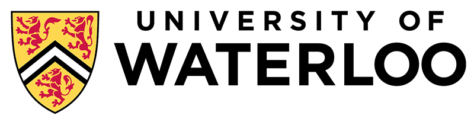

## Careers in Computer Science
# Mobile Applications Developer
### Description: A Mobile Applications Developer is required to program, test, and publish different applications for mobile devices.

## Responsibilities
* Support every step in the application’s life cycle.
* Write code that works in the most organized and effective way. 
* Troubleshoot any problems in the application.
* Code and publish any updates

## Required Skills
### Technical Skills:
- Knowledge of different programming languages
- Knowledge of different programming software
- Strong problem solving skills
- Strong analytical thinking skills

### Non-Technical Skills
- Communication Skills
- Teamworking Skills

## Required Education
* Degree in computer science or software engineering
* High school Diploma

## Salary Range
$48,000 to $124,000 ($77,333 Average)
***
## Education Option
### **Waterloo Computer Science**

### **Admission requirements**: 

#### **Pre-requisite Courses**:
* Advanced Functions 4U
* Calculus and Vectors 4U
* Any Grade 12 English
* One Additional 4U Course

#### **Recommended Course**:
* Grade 11 Computer Science

#### **General Program Requirements:** 
* High School Diploma
* 6 U or M courses including the required ones
* Admission Information Form (Supplementary Application)

### **Program Information:**
#### **First Year Coruses**
#### September - December: 
- Designing Functional Programs - **CS 135**
- Algebra for Honours Mathematics - **MATH 135**
- Calculus 1 for Honours Mathematics - **MATH 137**
- 1 Communication Skill Course
- One elective

#### **January to April:**
- Elementary Algorithm Design and Data Abstraction - **CS 136**
- Tools and Techniques for Software Development - **CS 136L**
- Linear Algebra 1 for Honours Mathematics - **MATH 136**
- Calculus 2 for Honours Mathematics - **MATH 138**
- Two electives

#### **Program Length: 5 Years with 2 Years of Co-op**
---
## Job Opportunities
| Experience |  Salary  | City | Job Description | Additional Skills |
| ---------- |:--------:|:----:|:---------------:|:-----------------:|
| 3 Years  | $75,000 - $100,000  |  Calgary  |

| Tables        | Are           | Cool  |
| ------------- |:-------------:| -----:|
| col 3 is      | right-aligned | $1600 |
| col 2 is      | centered      |   $12 |
| zebra stripes | are neat      |    $1 |

